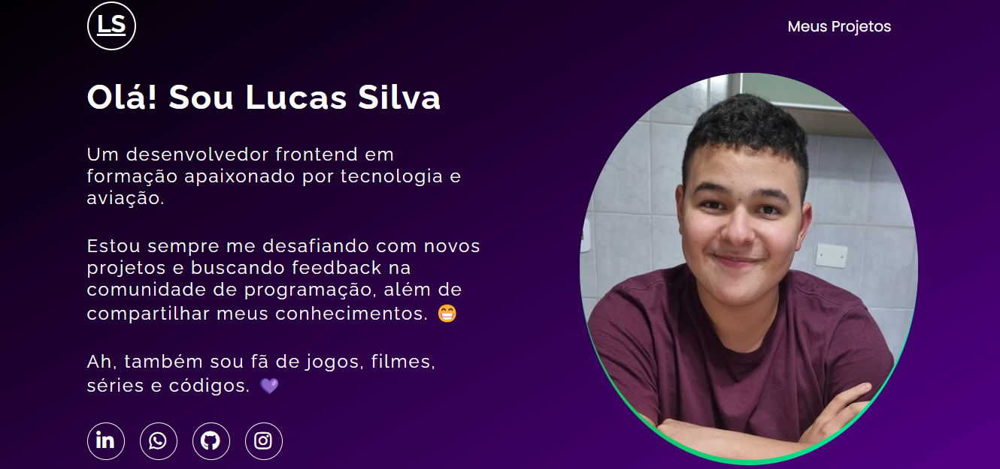

<h1 align="center">

</h1>Este é um projeto simples do meu portifólio e das principais linguagens que eu domino
  
<h2>Linguagens utilizadas</h2>
<li>HTML</li>
<ol>Feita para criar o corpo da aplicação web</ol>
<li>CSS</li>
<ol>Feita para fazer a estilização do texto</ol>
 

<h2>Tecnologias utilizadas nos 3 projetos</h3>
<li>HTML</li>
<li>CSS</li>
<li>JavaScript</li>
<li>Python</li>
<li>Inteligência Artificial</li>
<li>Java</li>

<h2>Projeto 1 - Apresentando os personagens favoritos do meu jogo favorito</h2>
<li>HTML</li>
<li>CSS</li>
<li>JavaScript</li> 
<video src="src/imagens/Scissor Seven_ Liga dos Assassinos - Google Chrome 2024-04-02 23-04-15.mp4">
                 

<h2>Projeto 2 - Cadastro automático de produtos</h2>

